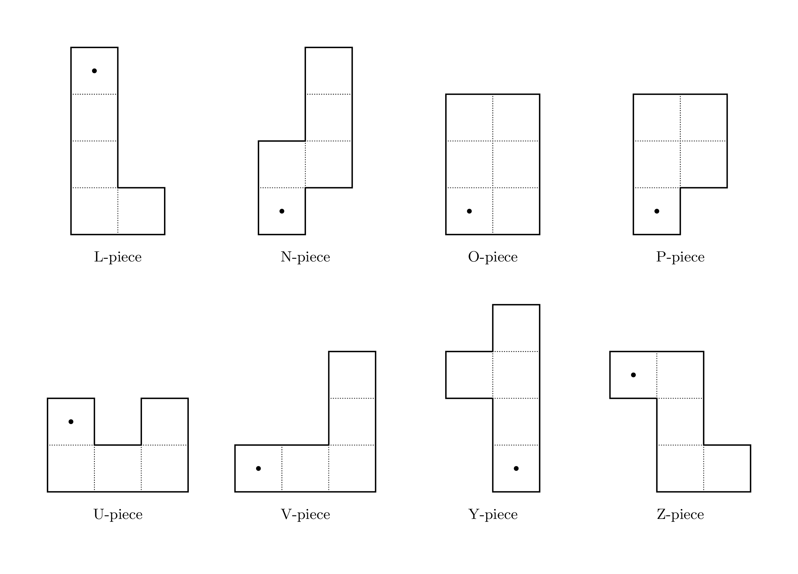
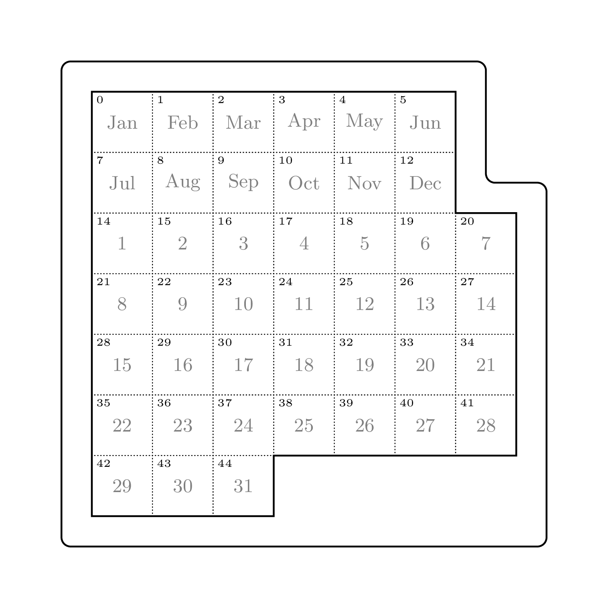
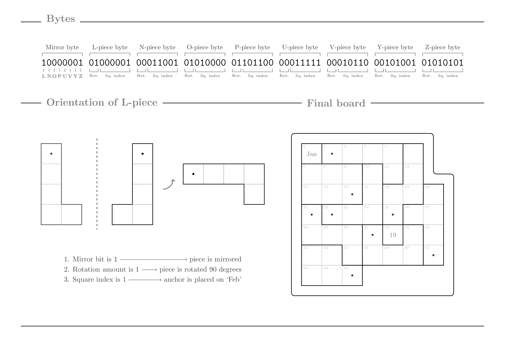

# The APAD file format

This software uses a custom binary file format to specify a set A-Puzzle-A-Day boards,
a board being some combination of valid piece placements (be it all, some, or none of the pieces).

An APAD file is split into contiguous chunks of exactly 9 bytes, each chunk describing one board.

Before describing the decoding process, we first need to descibe how the pieces are represented,
as well as the frame.

## Pieces

The image below shows the name of each piece and their base orientation.
Each piece is assigned an *anchor*, which is marked with a dot.

Pieces are ordered alphabetically: L, N, O, P, U, V, Y, Z.

## Frame

Each square in the frame is assigned a unique *index*, starting from zero on the 'Jan' square
and progressing sequentially from left to right and top to bottom.

Note that for ease of computation, the indices 6 and 13 are skipped.

## Boards

Each piece can be placed on 43 different starting squares (6 bits),
rotated up to 3 times (2 bits), and is possibly mirrored (1 bit).
Each piece placement can thus be described with 9 bits.

Conveniently enough, there are eight pieces in A-Puzzle-A-Day,
so grouping the placement bits and rotation bits into one byte for each
piece, and grouping each piece's mirror bit into one byte results in 9 bytes.

### Information

For each board described in APAD, the following applies:
- The first byte is the mirror byte, storing each piece's *mirror bit*.
- For the remaining eight bytes:
  - The two most significant bits of each byte denote the corresponding piece's *rotation amount*.
  - The six least significant bits of each byte denote the corresponding piece's *square index*.
- The order of the mirror bits aligns with the order of the remaining bytes
  from most to least significant.

### Decoding

To assemble the final board from this information, pieces are placed on an empty board in order.
For each piece, the following applies in order:
1. If the piece's mirror bit is 1, the piece is vertically mirrored.
2. The piece is rotated 90 degrees times its rotation amount counter-clockwise.
3. The piece is placed in the frame such that its anchor lands on the square with
   the piece's square index.

If a piece cannot be placed with this process, be it because of an invalid square index
or because it would intersect a previously placed piece or the edge of the frame,
then the piece is ignored and considered not placed.

Note that to deliberately exclude a piece in encoding,
one should prefer setting all bits corresponding to the piece to 1.

## Example

The following image shows the decoding of the first board specified in the `solutions.apad` file
found in this repository:

